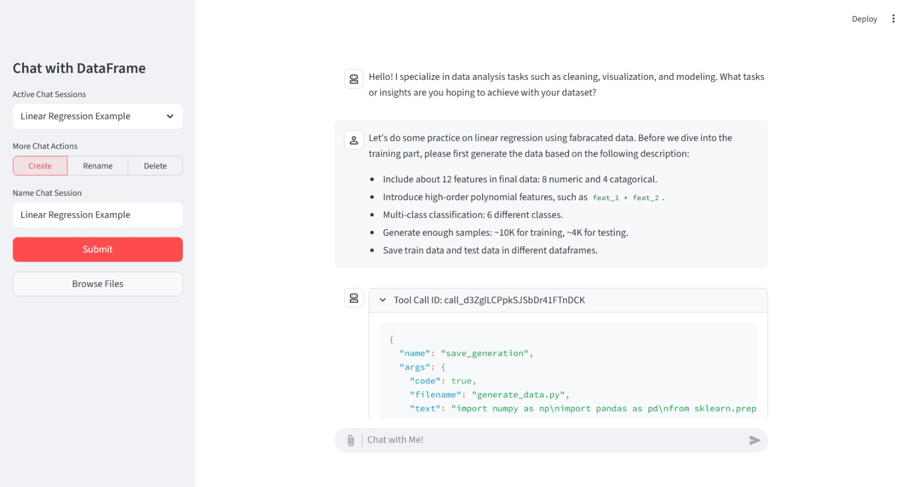

# Streamlit App - Chat with DataFrame

This project is a Streamlit application that allows users to interact with `pandas` DataFrames through natural language queries. The app leverages large language models (LLMs) to interpret user questions and generate appropriate `pandas` code to manipulate and analyze the provided DataFrame. Users can upload their own CSV data and ask questions about it using conversational language, making data analysis more accessible without requiring deep knowledge of `pandas` syntax.

## Overview

This demo project implements a simple chatbot based on `langchain` tool calling agent. The chatbot assists users in analyzing data stored in a `pandas` DataFrame. Users can upload their own CSV data and ask questions about it using natural language queries. The chatbot equips with two core tools: `save_generation` and `code_execution`. Furthermore, all messages are stored in a local `sqlite3` database.

## Installation Steps

1. Install `uv` by following [the official installation guide](https://docs.astral.sh/uv/getting-started/installation/).

2. Sync the dependencies by running `uv sync`.

3. Create a `.env` file, and fill in your OpenAI API key.

4. Run the Streamlit app via `streamlit run app.py`.

This will start the application locally, and you can access it through your web browser at the provided URL (typically something like `http://localhost:xxxx`).

## Notes

- This project is intended as a **beginner-level coding exercise** to demonstrate how to integrate LLMs with pandas for data analysis.
- It does not follow **best practices for agent development**, such as multi-agent orchestration or advanced planning techniques.
- The implementation avoids using the latest frameworks like `langgraph` or `agentscope` for simplicity and ease of understanding.
- If you find the implementation too basic or have suggestions for improvement, feel free to contribute or provide feedback!
- Have fun exploring and experimenting with the app!
